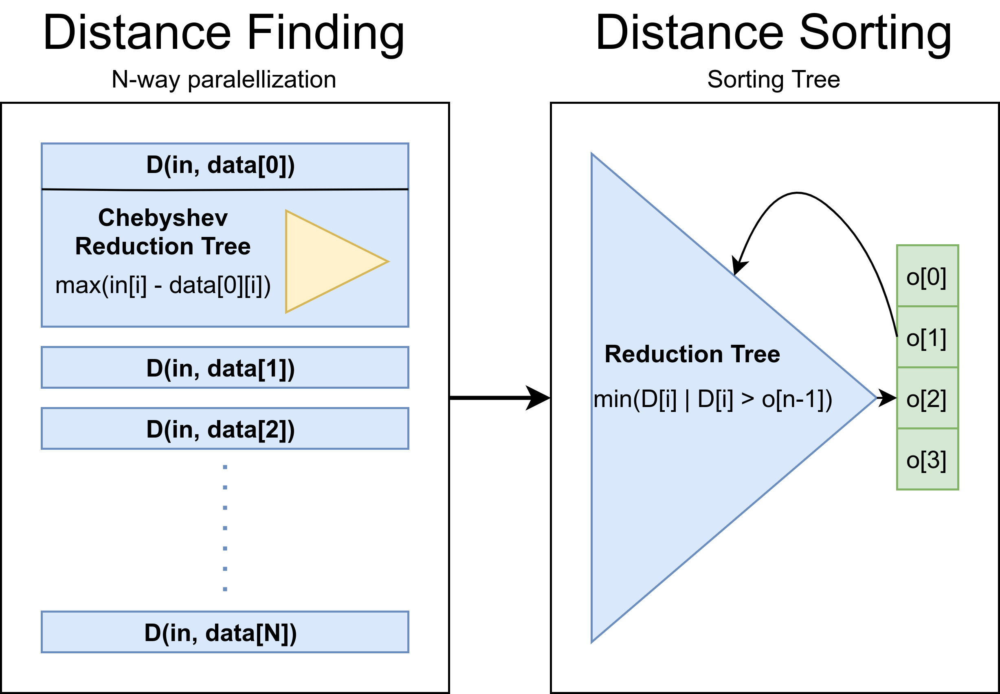

# EE109 Digital System Lab Final Report
Zach Belateche, Kathy Huang

## Table of Contents
- Application Overview
- Software Simulation
- Hardware Implementation
- Design Tradeoffs
- Appendix

## Application Overview
For our project, we accelerated the k-Nearest Neighbors machine learning algorithm. We used a dataset on iris plants with four features: sepal length, sepal width, petal length, and petal width. We used these features to characterize the iris in one of three classes (Iris SEtosa, Iris Versicolour, Iris Virginica). The dataset can be found at: https://archive.ics.uci.edu/ml/datasets/iris.

Multiple groups have implemented k-Nearest Neighbors on FPGAs in the past. Both Pu et. al [1] and Tian et. al[2] use a highly parallelized set of distance calculation elements, as the distance calculations can be fully parallelized. However, these sources differ in their method of sorting the distances to determine the k nearest neighbors. Pu et. al use a bubble sort, an algorithm that is simple to implement, but generally has poor performance on real-world tasks. Tian et al. use a predetermined range sort, which offers better efficiency, but limits the maximum value of k based on the hardware implementation.

## Software Simulation
In software, we implemented K-Nearest Neighbors on the Iris dataset using multiple distance metrics, as well as using SciKit Learn, and analyzed the performance. The simpler distance metrics (Chebyshev & Manhattan distance) offered faster run-times with comparable or better performance than the Euclidian distance.


**Figure 2: Accuracy vs K Value**


**Figure 2: Runtime vs K Value**

## Hardware Implementation
Like the implementations reported in literature, we used a highly parallelized set of distance calculation elements. We also used a predetermined range sort using k sequential reductions through a reduction tree; this yields k log(N) runtime with N log(N) resource utilization. A block diagram is provided in Figure 1.



**Figure 1: Block Diagram**

### Performance
After optimization, we classified 15 test points in 44944 cycles, with a classification accuracy of 93.33%.

With a 100 MHz clock rate, our design could classify 15 points in 449 us. The optimized software implementation could classify 15 points in, on average, about 1604 us while running on an Intel Xeon processor.  Thus, we ultimately achieved a 72% improvement over the software implementation.

Our resource utilization was:
```bash
+--------------------------------------+--------+-------+-----------+-------+
|               Site Type              |  Used  | Fixed | Available | Util% |
+--------------------------------------+--------+-------+-----------+-------+
| Slice LUTs                           | 113339 |     0 |    218600 | 51.85 |
|   LUT as Logic                       |  88458 |     0 |    218600 | 40.47 |
|   LUT as Memory                      |   4832 |     0 |     70400 |  6.86 |
|     LUT as Distributed RAM           |   2808 |     0 |           |       |
|     LUT as Shift Register            |   2024 |     0 |           |       |
|   LUT used exclusively as pack-thrus |  20049 |     0 |    218600 |  9.17 |
| Slice Registers                      |  96265 |     0 |    437200 | 22.02 |
|   Register as Flip Flop              |  96260 |     0 |    437200 | 22.02 |
|   Register as Latch                  |      0 |     0 |    437200 |  0.00 |
|   Register as pack-thrus             |      5 |     0 |    437200 | <0.01 |
| F7 Muxes                             |   1318 |     0 |    109300 |  1.21 |
| F8 Muxes                             |    268 |     0 |     54650 |  0.49 |
+--------------------------------------+--------+-------+-----------+-------+


```

## Design Choices

First, we got our baseline performance, with all data types as 32-bit fixed point numbers, no parallelization, the Manhattan distance, and a simple sorting tree. Our Spatial simulation achieved the following classification accuracy:

```
classification
2 0 2 2 2 1 2 0 0 2 0 0 0 1 2
gold
2 0 2 2 2 1 1 0 0 2 0 0 0 1 2
accuracy
14/15
0.933319091796875
```

Our VCS simulation ran in 92724 cycles, and had the following resource utilization:

```
+--------------------------------------+-------+-------+-----------+-------+
|               Site Type              |  Used | Fixed | Available | Util% |
+--------------------------------------+-------+-------+-----------+-------+
| Slice LUTs                           | 43632 |     0 |    218600 | 19.96 |
|   LUT as Logic                       | 29858 |     0 |    218600 | 13.66 |
|   LUT as Memory                      |  5006 |     0 |     70400 |  7.11 |
|     LUT as Distributed RAM           |  3076 |     0 |           |       |
|     LUT as Shift Register            |  1930 |     0 |           |       |
|   LUT used exclusively as pack-thrus |  8768 |     0 |    218600 |  4.01 |
| Slice Registers                      | 49044 |     0 |    437200 | 11.22 |
|   Register as Flip Flop              | 49039 |     0 |    437200 | 11.22 |
|   Register as Latch                  |     0 |     0 |    437200 |  0.00 |
|   Register as pack-thrus             |     5 |     0 |    437200 | <0.01 |
| F7 Muxes                             |  1282 |     0 |    109300 |  1.17 |
| F8 Muxes                             |   256 |     0 |     54650 |  0.47 |
+--------------------------------------+-------+-------+-----------+-------+
```

**We looked at three main ways to improve speed, resource utilization, and classification accuracy: lowering bit-precision, increasing parallelization, and changing the algorithm itself.**

### Distance Metrics

We started by investigating different distance metrics (Euclidean, Chebyshev, and Manhattan) to determine which resulted in the highest accuracy and the lowest resource utilization.

Our base implementation used the Manhattan distance, and achieved 93% classification accuracy, in 92724 cycles, with the resource utilization above. Using the Chebyshev distance gave the same classification accuracy (93%), a runtime of 97256 cycles, and a resource utilization of:
```
+--------------------------------------+-------+-------+-----------+-------+
|               Site Type              |  Used | Fixed | Available | Util% |
+--------------------------------------+-------+-------+-----------+-------+
| Slice LUTs                           | 43382 |     0 |    218600 | 19.85 |
|   LUT as Logic                       | 29764 |     0 |    218600 | 13.62 |
|   LUT as Memory                      |  5004 |     0 |     70400 |  7.11 |
|     LUT as Distributed RAM           |  3076 |     0 |           |       |
|     LUT as Shift Register            |  1928 |     0 |           |       |
|   LUT used exclusively as pack-thrus |  8614 |     0 |    218600 |  3.94 |
| Slice Registers                      | 48970 |     0 |    437200 | 11.20 |
|   Register as Flip Flop              | 48965 |     0 |    437200 | 11.20 |
|   Register as Latch                  |     0 |     0 |    437200 |  0.00 |
|   Register as pack-thrus             |     5 |     0 |    437200 | <0.01 |
| F7 Muxes                             |  1282 |     0 |    109300 |  1.17 |
| F8 Muxes                             |   256 |     0 |     54650 |  0.47 |
+--------------------------------------+-------+-------+-----------+-------+
```
This is slightly better than the Manhattan distance in all categories, likely due to the relative simplicity of using comparisons rather than additions. The other major advantage of the Chebyshev distance is that it significantly lowers the dynamic range of the values we're using, so we can use fewer bits to represent distances.

We also tried the Euclidean distance, which also gave us an accuracy of 93%. However, it ran in 105356 cycles, and had a resource utilization of:
```
+--------------------------------------+-------+-------+-----------+-------+
|               Site Type              |  Used | Fixed | Available | Util% |
+--------------------------------------+-------+-------+-----------+-------+
| Slice LUTs                           | 44141 |     0 |    218600 | 20.19 |
|   LUT as Logic                       | 30211 |     0 |    218600 | 13.82 |
|   LUT as Memory                      |  5357 |     0 |     70400 |  7.61 |
|     LUT as Distributed RAM           |  3076 |     0 |           |       |
|     LUT as Shift Register            |  2281 |     0 |           |       |
|   LUT used exclusively as pack-thrus |  8573 |     0 |    218600 |  3.92 |
| Slice Registers                      | 49939 |     0 |    437200 | 11.42 |
|   Register as Flip Flop              | 49876 |     0 |    437200 | 11.41 |
|   Register as Latch                  |     0 |     0 |    437200 |  0.00 |
|   Register as pack-thrus             |    63 |     0 |    437200 |  0.01 |
| F7 Muxes                             |  1282 |     0 |    109300 |  1.17 |
| F8 Muxes                             |   256 |     0 |     54650 |  0.47 |
+--------------------------------------+-------+-------+-----------+-------+
```
The Euclidian distance had the worst resource utilization across the board, likely due to the high hardware cost of multiplication. **As such, we decided to go with the Chebyshev distance as our distance metric, as it achieved the same accuracy as the other metrics while minimizing runtime and resource utilization.**

### Sorting Methods

Our base implementation used k reduction trees, performed sequentially, to find the k nearest neighbors to our test data point. We compared that to a mergesort, which could potentially allow for better runtime at the cost of more resource utilization, due to it sorting the whole list rather than finding just the lowest k elements. Our base implementation with the Chebyshev distance ran in 97256 cycles; with mergesort, it ran in 106968 cycles, and had the following resource utilization:
```
+--------------------------------------+--------+-------+-----------+-------+
|               Site Type              |  Used  | Fixed | Available | Util% |
+--------------------------------------+--------+-------+-----------+-------+
| Slice LUTs                           | 171951 |     0 |    218600 | 78.66 |
|   LUT as Logic                       | 153729 |     0 |    218600 | 70.32 |
|   LUT as Memory                      |   6306 |     0 |     70400 |  8.96 |
|     LUT as Distributed RAM           |   4228 |     0 |           |       |
|     LUT as Shift Register            |   2078 |     0 |           |       |
|   LUT used exclusively as pack-thrus |  11916 |     0 |    218600 |  5.45 |
| Slice Registers                      |  93765 |     0 |    437200 | 21.45 |
|   Register as Flip Flop              |  93760 |     0 |    437200 | 21.45 |
|   Register as Latch                  |      0 |     0 |    437200 |  0.00 |
|   Register as pack-thrus             |      5 |     0 |    437200 | <0.01 |
| F7 Muxes                             |   1461 |     0 |    109300 |  1.34 |
| F8 Muxes                             |    320 |     0 |     54650 |  0.59 |
+--------------------------------------+--------+-------+-----------+-------+
```
The fact that mergsort needs to sort the entire list, rather than just find the k smallest elements, significantly increases its resource utilization required to deliver the same performance, as k is often much smaller than the total size of the test set. **As such, we decided to use the k sequential reduction trees, rather than a mergesort, for our final implementation.**

### Bit Precision

For the iris dataset, we only have three possible labels, and have relatively low precision data points; thus, we can use significantly fewer bits for both our labels and our data points. This saves on SRAM usage and also yields smaller logic units, decreasing resource utilization.

The maximum value for a distance in our dataset is 7.9. Thus, the smallest data format we can use that fits our distances while still being aligned for our DRAM read and writes is an 8-bit, fixed-point value, with 4 fraction bits. We lose a bit of fractional precision, but changing to 8-bit values maintains our 93% accuracy. However, it does cause runtime to slightly increase, to 106636 cycles. This is likely due to the cost of converting labels from chars to integers, as SRAMs need to be integer-indexed. The resource utilization of the 8-bit version is:
```
+--------------------------------------+-------+-------+-----------+-------+
|               Site Type              |  Used | Fixed | Available | Util% |
+--------------------------------------+-------+-------+-----------+-------+
| Slice LUTs                           | 42203 |     0 |    218600 | 19.31 |
|   LUT as Logic                       | 29353 |     0 |    218600 | 13.43 |
|   LUT as Memory                      |  3854 |     0 |     70400 |  5.47 |
|     LUT as Distributed RAM           |  1980 |     0 |           |       |
|     LUT as Shift Register            |  1874 |     0 |           |       |
|   LUT used exclusively as pack-thrus |  8996 |     0 |    218600 |  4.12 |
| Slice Registers                      | 47656 |     0 |    437200 | 10.90 |
|   Register as Flip Flop              | 47651 |     0 |    437200 | 10.90 |
|   Register as Latch                  |     0 |     0 |    437200 |  0.00 |
|   Register as pack-thrus             |     5 |     0 |    437200 | <0.01 |
| F7 Muxes                             |  1359 |     0 |    109300 |  1.24 |
| F8 Muxes                             |   296 |     0 |     54650 |  0.54 |
+--------------------------------------+-------+-------+-----------+-------+
```
Switching to 8-bit values decreased resource utilization, especially of LUTs used as memory, as the amount of memory that we need to store is now much smaller. **As such, we decided to use 8-bit values for our optimized algorithm.**

### Paralellization

Finally, we experimented with different parallelization values to find a good compromise between runtime and resource utilization.

Looking at the initial instrumentation hooks, the bottleneck in the original, unparallelized implementation was in the loading of the SRAMs. Thus, the first parameter we decided to parallelize to reduce this bottleneck was the `load_par`. In order to find thhe best compromise between runtime and resource utilization, we looked at cycle count for different values for the `load_par` parameter and the effect on runtime as measured by cycle count. Since we never maxed out our resource utilization, we were able to find the best balance between performance and resource utilization by simply looking at when the performance would stagnate. When this would happen, increasing the parallelization would not increase performance but would increase resource utilization, so the tradeoff would clearly not be worth it after this point. We then repeated this procedure multiple times by looking at the instrumentation hooks and parallizing the other bottlenecks. In the end, after tuning all parallelization factors, cycle count went from the original 92724 cycle down to 44944 cycles. Naturally, the resource utilization increased, which is displayed below:

```
+--------------------------------------+--------+-------+-----------+-------+
|               Site Type              |  Used  | Fixed | Available | Util% |
+--------------------------------------+--------+-------+-----------+-------+
| Slice LUTs                           | 113339 |     0 |    218600 | 51.85 |
|   LUT as Logic                       |  88458 |     0 |    218600 | 40.47 |
|   LUT as Memory                      |   4832 |     0 |     70400 |  6.86 |
|     LUT as Distributed RAM           |   2808 |     0 |           |       |
|     LUT as Shift Register            |   2024 |     0 |           |       |
|   LUT used exclusively as pack-thrus |  20049 |     0 |    218600 |  9.17 |
| Slice Registers                      |  96265 |     0 |    437200 | 22.02 |
|   Register as Flip Flop              |  96260 |     0 |    437200 | 22.02 |
|   Register as Latch                  |      0 |     0 |    437200 |  0.00 |
|   Register as pack-thrus             |      5 |     0 |    437200 | <0.01 |
| F7 Muxes                             |   1318 |     0 |    109300 |  1.21 |
| F8 Muxes                             |    268 |     0 |     54650 |  0.49 |
+--------------------------------------+--------+-------+-----------+-------+
```


## Appendix

All of our source code is located on github, at `https://github.com/khuang/ee109`.

## References
[1] Y. Pu, J. Peng, L. Huang and J. Chen, "An Efficient KNN Algorithm Implemented on FPGA Based Heterogeneous Computing System Using OpenCL," 2015 IEEE 23rd Annual International Symposium on Field-Programmable Custom Computing Machines, Vancouver, BC, 2015, pp. 167-170.

[2] Miren Tian, Xin'an Wang, Xing Zhang, Zhiqiang Yang, Jipan Huang and Hao Chen, "The implementation of a KNN classifier on FPGA with a parallel and pipelined architecture based on Predetermined Range Search," 2016 13th IEEE International Conference on Solid-State and Integrated Circuit Technology (ICSICT), Hangzhou, 2016, pp. 1491-1493.
