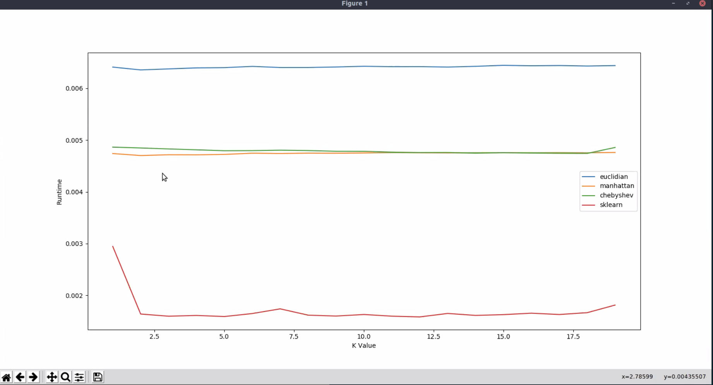

# Milestone 1 Submission

## Application Description:
We implemented K-Nearest Neighbors on the Iris dataset using multiple distance metrics, as well as using SciKit Learn, and analyzed the performance. The simpler distance metrics (Chebyshev & Manhattan distance) offered faster run-times with comparable or better performance than the Euclidian distance; as such, these are the main distance metrics we're considering for our hardware implementation.

## Software Implementation:

Our software implementation is located on github, at `https://github.com/khuang/ee109`.

## Setup Instructions:

Running our application requires python3.6 or above with sklearn.
Just run:
```bash
python knn.py
```
The performance metrics will automatically be plotted.

## Performance Analysis:


**Figure 1: Runtime vs K Value**